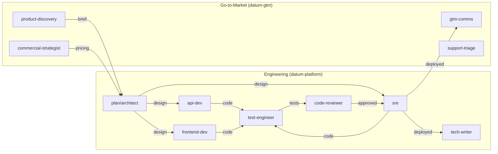

# Available Agents

Each agent has a focused domain. Invoke them by name or let the pipeline command route work automatically.

## Agent Overview



## Table of Contents

- [product-discovery](#product-discovery)
- [commercial-strategist](#commercial-strategist)
- [plan (Architect)](#plan-architect)
- [api-dev](#api-dev)
- [frontend-dev](#frontend-dev)
- [sre](#sre)
- [test-engineer](#test-engineer)
- [code-reviewer](#code-reviewer)
- [tech-writer](#tech-writer)
- [gtm-comms](#gtm-comms)
- [support-triage](#support-triage)

---

## product-discovery

| | |
|---|---|
| **Plugin** | `datum-gtm` |
| **Stage** | `discovery` |
| **Output** | `.claude/pipeline/briefs/{id}.md` |

**When to use:** When someone has a feature idea, problem statement, or enhancement request that has not been formalized. Use this agent before anything else when requirements are vague.

The product-discovery agent asks questions to sharpen understanding of the problem before anyone commits to a solution. Its output is a discovery brief, not a spec. A brief contains the actual problem statement (not just the requested solution), target users, scope boundaries, success criteria, and an assessment of which platform capabilities apply.

The agent runs a 5-phase process: understand the problem, identify users, scope and prioritize, surface constraints, and assess platform capabilities (quota, insights, telemetry, activity).

> **Do not use** when requirements are already clear — proceed directly to the `spec` stage instead.

**Example invocation:**
```bash
/discover VM snapshot management for compliance requirements
```

---

## commercial-strategist

| | |
|---|---|
| **Plugin** | `datum-gtm` |
| **Stage** | `pricing` |
| **Output** | `.claude/pipeline/pricing/{id}.md` |

**When to use:** When designing pricing, setting quota defaults per tier, or evaluating the commercial implications of a new feature. Use this agent before the architect designs quota integrations.

The commercial-strategist analyzes the feature against Datum Cloud's tier model (Free, Pro, Enterprise) and produces recommendations for quota limits per tier with rationale. The agent applies a key principle: quotas should feel generous at each tier so the upgrade trigger is growth, not frustration.

Outputs include a pricing brief, offer design, quota recommendations per tier, and a commercial impact assessment covering migration considerations for existing consumers.

---

## plan (Architect)

| | |
|---|---|
| **Plugin** | `datum-platform` |
| **Stage** | `design` |
| **Output** | `.claude/pipeline/designs/{id}.md` |

**When to use:** Before any implementation begins, when the feature involves new API resources, controllers, event processing, or platform capability integrations. Use AFTER discovery and pricing, BEFORE api-dev.

The plan agent reads the discovery brief, spec, and pricing brief, then produces a design document that implementation agents use to build the feature. The design covers resource types, API definitions, storage design, event processing, platform capability integrations (IAM, quota, activity), security considerations, and an ordered implementation plan.

Designs follow a structured format with a front matter status field (`draft`, `review`, or `approved`).

> **Does not produce:** Code, tests, documentation.

---

## api-dev

| | |
|---|---|
| **Plugin** | `datum-platform` |
| **Stage** | `implementation` |
| **Input** | `.claude/pipeline/designs/{id}.md` |
| **Output** | Code changes in the repository |

**When to use:** For all Go backend implementation on Kubernetes aggregated API servers. Use for API types, storage backends, server configuration, request handlers, code generation, and any Go code in `cmd/`, `internal/`, or `pkg/` directories.

The api-dev agent reads the design document first, then implements it using established patterns from the `k8s-apiserver-patterns` skill. Key patterns enforced:

- Storage interface uses `rest.Storage`, not `rest.StandardStorage`
- `NewREST` returns a `(*REST, *StatusREST)` pair
- `sync.Once` for storage initialization
- Explicit `Install()` for scheme registration, not `init()`
- Kubebuilder markers for validation, not manual validation code

The agent also runs scaffold scripts for boilerplate (`scaffold-resource.sh`, `scaffold-storage.sh`) and validates work by running `task generate`, `task lint`, and `task test` before declaring done.

When the agent discovers a reusable insight during implementation, it logs it to `.claude/session-learnings.jsonl` for the learning engine to pick up.

> **Guarantees:** Code compiles, tests pass, lint passes.

---

## frontend-dev

| | |
|---|---|
| **Plugin** | `datum-platform` |
| **Stage** | `implementation` |
| **Input** | `.claude/pipeline/designs/{id}.md` |
| **Output** | UI code changes in the repository |

**When to use:** For React/TypeScript UI implementation, component development, page layouts, form implementation, dashboard creation, and any frontend code changes.

The frontend-dev agent builds management interfaces using the platform's established stack: React 18 with TypeScript, Tailwind CSS, shadcn/ui components, TanStack Query for server state, React Router, and React Hook Form with Zod validation.

Key requirements enforced:

- Every data-fetching component handles four states: loading (skeleton), empty (helpful message + action), error (retry button), and data
- Design tokens are used for all colors and spacing — no hardcoded `bg-white` or `text-gray-600`
- Semantic HTML for accessibility (WCAG 2.1 AA)
- IAM-aware views: hide actions the user lacks permission for rather than showing disabled buttons
- TypeScript types derived from Go API types in `pkg/apis/*/v1alpha1/types.go`

> **Guarantees:** Components handle all states, use design tokens, pass accessibility basics.

---

## sre

| | |
|---|---|
| **Plugin** | `datum-platform` |
| **Stage** | `implementation`, `deploy` |
| **Output** | Changes to `config/`, `.github/workflows/`, `Dockerfile`, `Taskfile.yaml` |

**When to use:** For Kustomize manifests, CI/CD pipeline configuration, Dockerfile changes, RBAC configuration, observability setup, FluxCD deployment, OCIRepository configuration, and any infrastructure-as-code changes. Use for anything in `config/`, `.github/`, `Dockerfile`, or infra repository changes.

The sre agent understands the two-context deployment model:

| Context | Location | Purpose |
|:--------|:---------|:--------|
| Local/Test | Kustomize in service repo (`config/`) | Local dev and CI |
| Production | FluxCD in infra repo (`datum-cloud/infra`) | Staging and production |

Container security requirements enforced by this agent are non-negotiable: distroless base image, non-root user, read-only root filesystem, all capabilities dropped.

Services are deployed via FluxCD using OCIRepository resources that pull complete Kustomize bundles from the container registry — not individual images. This means configuration is versioned atomically with the image.

> **Guarantees:** All Kustomize overlays build, security checks pass.

---

## test-engineer

| | |
|---|---|
| **Plugin** | `datum-platform` |
| **Stage** | `test` |
| **Input** | Implemented code in the repository |
| **Output** | Test files in the repository |

**When to use:** After implementation is complete, or when someone says "write tests for" or "add test coverage for."

The test-engineer agent writes thorough, maintainable Go tests using table-driven patterns, testify assertions, and the Setup/Execute/Verify structure. Coverage requirements include happy path, error cases, edge cases, state transitions, and concurrency where relevant.

When the service profile declares platform capabilities, the test-engineer adds specific integration tests:

| Capability | Test Coverage |
|:-----------|:--------------|
| Quota | Verify creation is rejected at limit; quota released on deletion |
| Insights | Verify detectors trigger on conditions; evidence populated correctly |
| Telemetry | Verify metrics emitted with correct names and labels |
| Activity | Verify ActivityPolicy exists for resource kinds; test with PolicyPreview |

> **Guarantees:** All tests pass, coverage includes happy path and error cases.

---

## code-reviewer

| | |
|---|---|
| **Plugin** | `datum-platform` |
| **Stage** | `review` |
| **Output** | Review findings (conversational output plus `.claude/review-findings.jsonl`) |

**When to use:** After api-dev, frontend-dev, or sre complete changes. Use when someone says "review this" or "is this ready to merge." This agent is the quality gate before code merges.

The code-reviewer is read-only — it produces findings but never modifies code. It runs in `plan` mode and uses the `opus` model for the thoroughness the role requires.

**Review dimensions:**

| Dimension | What it checks |
|:----------|:---------------|
| Architecture | Correct control plane pattern (aggregated API server vs. CRD) |
| Correctness | Does the code match the design? Are edge cases handled? |
| Security | Input validation, IAM integration, tenant isolation, secrets handling, container security |
| Conventions | Import grouping, test file naming, boilerplate, API type structure |
| Platform integration | Runs validation scripts for each capability declared in the service profile |

Deterministic checks are run automatically via scripts (`check-imports.sh`, `validate-types.sh`, `check-security.sh`, and others). Script failures become blocking findings.

After review, findings are logged to `.claude/review-findings.jsonl` with structured pattern names. This data feeds the learning engine. The review produces a structured output with summary, blocking findings, warnings, and nits.

> **Does not produce:** Code fixes, designs, specs.

---

## tech-writer

| | |
|---|---|
| **Plugin** | `datum-platform` |
| **Stage** | `document` |
| **Output** | Documentation files in `docs/`, README updates, inline code comments |

**When to use:** When someone says "document this," "write a guide for," or "update the README." Use after code is implemented and reviewed.

The tech-writer agent produces documentation verified against the actual code. It reads task files to verify commands, reads `types.go` to verify API fields, and reads existing docs for style consistency. It never documents behavior it has not verified.

**Document types produced:**

| Type | Format |
|:-----|:-------|
| API Reference | Generated from Go types; includes fields table, example YAML, allowed verbs, status conditions |
| Onboarding Guide | Step-by-step with verification checkpoints |
| Operational Runbook | Decision tree format for troubleshooting |
| Configuration Reference | Every environment variable, flag, and config option |
| Migration Guide | Breaking changes, upgrade procedure, rollback |
| Changelog | Keep a Changelog format |

> **Guarantees:** Every command verified against task definitions, every API field verified against types.go.

---

## gtm-comms

| | |
|---|---|
| **Plugin** | `datum-gtm` |
| **Stage** | `announce` |
| **Output** | Content drafts at `.claude/pipeline/comms/{id}-{type}.md` |

**When to use:** When a feature is ready to announce. Use for blog posts, social media content, email announcements, changelog entries, internal enablement briefs, or community posts.

The gtm-comms agent reads all pipeline artifacts for the feature (briefs, specs, pricing, designs) and reads documentation to verify claims before writing. It produces audience-appropriate content:

| Audience | Content Types |
|:---------|:--------------|
| Platform engineers | Technical blog post, deep dive, reference docs |
| Decision makers | Executive summary, competitive differentiation, TCO analysis |
| Existing consumers | Changelog, upgrade guide, feature announcement |
| Community | Problem-first narrative (problem → approach → what was built → learnings) |
| Internal teams | Enablement brief with talking points, objection handling, FAQ |

Content is always flagged for human review before publication. The agent never commits to dates, roadmap items, or fabricates capability claims.

---

## support-triage

| | |
|---|---|
| **Plugin** | `datum-gtm` |
| **Stage** | N/A (support workflow) |
| **Output** | Categorized issue with routing recommendation |

**When to use:** When a consumer reports a problem, when categorizing incoming support requests, or when assessing severity and routing. Use this agent BEFORE debugging — triage first, then investigate.

The support-triage agent extracts symptom, scope, timeline, impact, and environment from a consumer report without accepting the consumer's diagnosis as correct. It checks GitHub issues for known matches, queries the activity log to see what actually happened around the reported time, and checks recent git commits for deployments that correlate with the timeline.

**Severity classification:**

| Level | Criteria | Response |
|:------|:---------|:---------|
| Critical | Service down, data loss | Immediate escalation |
| High | Major feature broken, no workaround | Same-day response |
| Medium | Feature degraded, workaround exists | Normal queue |
| Low | Cosmetic, minor inconvenience | Backlog |

After categorization, the agent routes to the appropriate next step: debugger agent for bugs, product-discovery for missing features, tech-writer for documentation gaps.

> **Does not produce:** Root cause analysis, code fixes, architecture changes.
