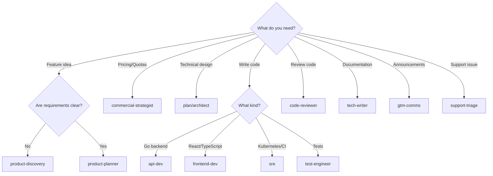

# Best Practices

Tips for effective feature delivery using the Datum Cloud Claude Code plugins.

## Table of Contents

- [Start with Discovery](#start-with-discovery)
- [Read Handoff Headers](#read-handoff-headers)
- [Resolve Blocking Questions](#resolve-blocking-questions)
- [Use the Right Agent](#use-the-right-agent)
- [Run /evolve Regularly](#run-evolve-regularly)
- [Keep Service Profiles Current](#keep-service-profiles-current)
- [Log Session Learnings](#log-session-learnings)

---

## Start with Discovery

**Even when requirements seem clear, start with discovery.**

Skipping discovery saves time in the short term and costs it later. Even features with "clear" requirements benefit from one discovery session to assess platform capability implications (quota, insights, telemetry, activity). These decisions affect architecture.

Use `/discover` instead of jumping straight to the architect. It prevents wasted implementation effort.

**Good:**
```bash
/discover VM snapshot management for compliance requirements
```

**Avoid:**
```bash
# Jumping straight to design without discovery
/pipeline route feat-042 design
```

---

## Read Handoff Headers

**Read handoff headers before diving into artifact bodies.**

Every pipeline artifact contains a handoff header that summarizes decisions made and questions still open. Read it first before diving into the artifact body. This is especially important for implementation agents — the handoff header tells you what was decided and what requires judgment calls.

The handoff header contains:
- `context_summary` — what this artifact represents
- `decisions_made` — key decisions with rationale
- `open_questions` — unresolved items
- `assumptions` — what was assumed

---

## Resolve Blocking Questions

**Never use `--force` as your first option.**

The pipeline prevents advancing past a stage with blocking open questions. If you find yourself wanting to use `--force` to skip this check, stop and resolve the question instead. Blocking questions exist because unresolved assumptions compound into larger problems downstream.

**Questions to ask yourself:**
- Can I answer this question with 5 minutes of research?
- Is there someone who owns this decision I can consult?
- Will this question come back as a review finding?

If the answer to any of these is yes, resolve the question before advancing.

---

## Use the Right Agent

**Agents are designed for specific work. Routing work to the wrong agent produces lower-quality output.**

| Don't | Do |
|:------|:---|
| Ask api-dev to write documentation | Use tech-writer for documentation |
| Ask tech-writer to review Go code | Use code-reviewer for reviews |
| Ask code-reviewer to fix issues | Code-reviewer is read-only by design |
| Ask product-discovery to write specs | Use product-planner for specs |

The `/pipeline next` command handles routing automatically. When invoking agents directly, use the agent descriptions to choose correctly.

### Agent Selection Flowchart



### Agent Selection Guide

| Task | Agent |
|:-----|:------|
| Vague feature idea | product-discovery |
| Clear requirements to formalize | product-planner |
| Pricing or quota decisions | commercial-strategist |
| System design | plan (architect) |
| Go backend code | api-dev |
| React/TypeScript UI | frontend-dev |
| Kubernetes manifests, CI/CD | sre |
| Writing tests | test-engineer |
| Quality gate before merge | code-reviewer |
| User-facing documentation | tech-writer |
| Launch announcements | gtm-comms |
| Categorizing support issues | support-triage |

---

## Run /evolve Regularly

**Pattern knowledge accumulates silently. Nothing automatically updates runbooks.**

Pattern knowledge accumulates silently in `.claude/review-findings.jsonl` and `.claude/session-learnings.jsonl`. Nothing automatically updates runbooks — you must run `/evolve` to promote learnings.

**Recommended schedule:**

| Frequency | Action |
|:----------|:-------|
| Weekly | Run `/evolve` on active services |
| Monthly | Review auto-generated runbook entries for accuracy |

A weekly `/evolve` run on active services keeps agent runbooks current with patterns specific to that codebase. This is especially valuable for catching recurrence of patterns that were previously fixed.

```bash
# Weekly command
/evolve

# Check what would change first
/evolve --dry-run
```

---

## Keep Service Profiles Current

**Stale service profiles cause agents to skip required integrations or attempt integrations that don't apply.**

Many agents read `.claude/service-profile.md` to understand which platform capabilities are active. If this file is stale, agents may skip integrations that are actually required, or attempt integrations for capabilities that don't apply.

**Update the service profile when:**
- New platform capabilities are enabled
- Quota dimensions change
- New resource types are added
- Service dependencies change

### Service Profile Location

```
.claude/service-profile.md
```

### Example Service Profile

```yaml
service: compute-api
capabilities:
  quota: true
  insights: true
  telemetry: true
  activity: true
resource_types:
  - VirtualMachine
  - Disk
  - Snapshot
quota_dimensions:
  - virtual_machines
  - disks_gb
  - snapshots
```

---

## Log Session Learnings

**Capture non-obvious insights as you work.**

When you notice that an agent discovered something non-obvious during implementation — a gotcha with a library, a pattern that worked particularly well, a mistake that was easy to make — log it to `.claude/session-learnings.jsonl`. The format is documented in the `learning-engine` skill.

These learnings feed `/evolve` and eventually appear in runbooks, preventing future agents from rediscovering the same things.

### What to Log

| Log | Don't Log |
|:----|:----------|
| Library gotchas discovered the hard way | Standard patterns already in documentation |
| Patterns that worked particularly well | Obvious best practices |
| Mistakes that were easy to make | One-off bugs |
| Service-specific quirks | General Go/React knowledge |

### Example Learning Entry

```json
{
  "timestamp": "2025-01-15T15:00:00Z",
  "feature_id": "feat-042",
  "agent": "api-dev",
  "insight": "Storage initialization must use sync.Once to prevent race conditions during concurrent reconciliation",
  "context": "Discovered when tests failed intermittently under parallel execution"
}
```
