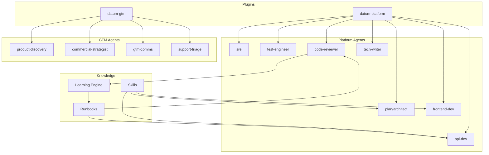

# Datum Cloud Claude Code Plugins

> **Last verified:** 2026-02-18 against v1.0.0

This documentation covers how to use the Datum Cloud Claude Code plugins to deliver features efficiently — from initial idea through production deployment and announcement.

## Documentation

| Guide | Description |
|:------|:------------|
| [Getting Started](#getting-started) | Installation and setup |
| [Pipeline Workflow](pipeline.md) | Feature delivery stages and commands |
| [Agents](agents.md) | Specialized agents and when to use them |
| [Skills and Runbooks](skills-and-runbooks.md) | Knowledge modules and the learning system |
| [Best Practices](best-practices.md) | Tips for effective feature delivery |
| [Troubleshooting](troubleshooting.md) | Common issues and resolutions |

---

## Overview

The Datum Cloud Claude Code plugins extend Claude Code with specialized agents, slash commands, and knowledge modules (skills) designed for shipping features on the Datum Cloud Kubernetes platform. Rather than using a general-purpose assistant for every task, the system routes work to agents with deep, narrow expertise: the architect designs, the api-dev implements, the code-reviewer gates quality, and so on.

The system is organized into two plugins:

| Plugin | Focus | Agents |
|:-------|:------|:-------|
| `datum-platform` | Engineering delivery | plan, api-dev, frontend-dev, sre, test-engineer, code-reviewer, tech-writer |
| `datum-gtm` | Go-to-market | product-discovery, commercial-strategist, gtm-comms, support-triage |

### Why It Exists

Building features on a multi-tenant Kubernetes platform involves recurring decisions that benefit from accumulated knowledge: which storage pattern to use, how to model IAM permissions, how to wire quota enforcement, what container security settings are required. Each agent in the system carries that knowledge so individual engineers don't have to rediscover it on every feature.

The pipeline structure also makes hand-offs explicit. When the architect finishes a design, the implementation agents know exactly what to read. When the code-reviewer finishes, their findings feed a learning engine that updates future agent behavior.

### System Architecture



---

## Getting Started

### Adding the Marketplace

Add the Datum Cloud plugin marketplace to Claude Code:

```bash
/plugin marketplace add datum-cloud/claude-code-plugins
```

Or configure it in your project's `.claude/settings.json` to make the marketplace available to all team members who trust the project folder:

```json
{
  "extraKnownMarketplaces": {
    "datum-claude-code-plugins": {
      "source": {
        "source": "github",
        "repo": "datum-cloud/claude-code-plugins"
      }
    }
  }
}
```

### Installing the Plugins

Once the marketplace is added:

```bash
/plugin install datum-platform@datum-claude-code-plugins
/plugin install datum-gtm@datum-claude-code-plugins
```

To pre-enable both plugins for everyone on the project, add to `.claude/settings.json`:

```json
{
  "enabledPlugins": {
    "datum-platform@datum-claude-code-plugins": true,
    "datum-gtm@datum-claude-code-plugins": true
  }
}
```

### Local Development

To test plugin changes locally before pushing:

```bash
/plugin marketplace add ./path/to/claude-code-plugins
/plugin install datum-platform@datum-claude-code-plugins
```

### Verifying Installation

After installation, the slash commands become available. Verify with:

```bash
/pipeline list
```

If the pipeline command responds (even with "no active pipelines"), the `datum-platform` plugin is installed correctly.

---

## Quick Start

1. **Start a new feature:**
   ```bash
   /discover VM snapshot management for compliance requirements
   ```

2. **Check pipeline status:**
   ```bash
   /pipeline status feat-042
   ```

3. **Advance to next stage:**
   ```bash
   /pipeline next feat-042
   ```

4. **Review code before merge:**
   ```bash
   /review feat-042
   ```

5. **Deploy when ready:**
   ```bash
   /deploy feat-042
   ```

For complete details, see the [Pipeline Workflow](pipeline.md) guide.
