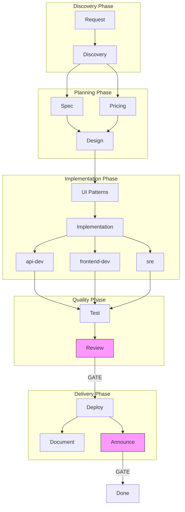

# Pipeline Workflow

The pipeline is a structured sequence of stages that moves a feature from idea to announcement. Each stage has a designated agent, produces an artifact, and may require human approval before the next stage begins.

## Table of Contents

- [Stage Overview](#stage-overview)
- [Dependency Graph](#dependency-graph)
- [Artifacts](#artifacts)
- [Handoff Headers](#handoff-headers)
- [Skipping Stages](#skipping-stages)
- [Pipeline Commands](#pipeline-commands)
- [Human Gates](#human-gates)

---

## Stage Overview

```
request → discovery → spec → pricing → design → ui-patterns →
  implementation → test → review → deploy → document → announce
```

| Stage | Agent | Output |
|:------|:------|:-------|
| discovery | product-discovery | `.claude/pipeline/briefs/{id}.md` |
| spec | product-planner | `.claude/pipeline/specs/{id}.md` |
| pricing | commercial-strategist | `.claude/pipeline/pricing/{id}.md` |
| design | plan (architect) | `.claude/pipeline/designs/{id}.md` |
| ui-patterns | frontend-dev | `.claude/pipeline/ui-patterns/{id}.md` |
| implementation | api-dev, frontend-dev, sre | Code changes |
| test | test-engineer | Test files |
| review | code-reviewer | Review findings |
| deploy | sre | Deployment manifests |
| document | tech-writer | Documentation |
| announce | gtm-comms | `.claude/pipeline/comms/{id}.md` |

---

## Dependency Graph

Not all stages run sequentially. Some run in parallel to save time:



After discovery completes, `spec` (product-planner) and `pricing` (commercial-strategist) run in parallel. After deploy, `document` (tech-writer) and `announce` (gtm-comms) run in parallel.

**Gate stages** (highlighted) require human approval before proceeding.

---

## Artifacts

Every stage produces a structured artifact stored under `.claude/pipeline/`:

```
.claude/pipeline/
├── requests/     # Initial feature requests
├── briefs/       # Discovery output (product-discovery)
├── specs/        # Requirements (product-planner)
├── pricing/      # Commercial strategy (commercial-strategist)
├── designs/      # Architecture (plan/architect)
├── ui-patterns/  # UI specifications (frontend-dev)
├── comms/        # GTM content (gtm-comms)
└── state/        # Pipeline state files
```

Artifacts use the naming pattern `{id}-{name}.md` — for example, `feat-042-vm-snapshot-management.md`.

---

## Handoff Headers

Every artifact includes a YAML front matter block called the handoff header. This is how agents communicate context across stage boundaries without humans manually summarizing. Key fields:

| Field | Purpose |
|:------|:--------|
| `context_summary` | What this artifact represents |
| `decisions_made` | Key decisions with rationale |
| `open_questions` | Unresolved items, flagged blocking or non-blocking |
| `assumptions` | What was assumed and at what confidence |
| `platform_capabilities` | Whether quota, insights, telemetry, and activity apply |

Downstream agents read the handoff header first. Blocking open questions must be resolved before the pipeline can advance.

---

## Skipping Stages

Not every feature needs every stage. Use `/pipeline route` to jump directly to the relevant stage:

| Scenario | Route |
|:---------|:------|
| Bug fix with clear requirements | `implementation` |
| Documentation-only change | `document` |
| Urgent hotfix | `implementation` → `/deploy --hotfix` |
| Feature with pre-approved design | `design` |

---

## Pipeline Commands

All pipeline commands are available after installing the `datum-platform` plugin.

### Starting a Feature

```bash
# Quick-start: creates request artifact and invokes product-discovery immediately
/discover VM snapshot management for compliance requirements

# Manual start: creates pipeline entry, then you invoke agents
/pipeline start vm-snapshot-management
```

`/discover` is the recommended entry point for new features. It generates a feature ID (`feat-{NNN}`), creates the request artifact, and hands off to product-discovery.

### Checking Status

```bash
/pipeline status feat-042
```

Output shows current stage, completed stages, artifact locations, gate status, and next actions:

```
Feature: feat-042-vm-snapshots
Current Stage: spec (in progress)
Completed: [discovery, pricing]
Artifacts:
  - briefs/feat-042-vm-snapshots.md (complete)
  - pricing/feat-042-vm-snapshots.md (complete)
  - specs/feat-042-vm-snapshots.md (in progress)
Human Gates Passed: [spec: pending, pricing: approved]
Next: Complete spec, then await human approval
```

### Advancing the Pipeline

```bash
/pipeline next feat-042
```

The pipeline validates that the current stage artifact exists, the handoff header has no blocking open questions, and required gates are approved. Then it invokes the appropriate agent for the next stage.

If validation fails, the command explains why:

```
Warning: Artifact has unresolved open questions
Open Questions:
  - Should snapshots count against storage quota?
Action: Resolve questions before advancing, or use --force to proceed
```

### Listing Active Features

```bash
/pipeline list
```

Shows all features grouped by status: active, blocked, and completed.

### Routing to a Specific Stage

```bash
/pipeline route feat-042 implementation   # Skip to implementation (bug fixes)
/pipeline route feat-042 deploy           # Skip to deploy (hotfix)
/pipeline route feat-042 document         # Documentation-only change
```

### Code Review

```bash
/review                        # Review current branch changes
/review feat-042               # Review specific feature
/review --diff main            # Review diff against main
```

The `/review` command detects the feature ID from the branch name, loads pipeline context automatically, and invokes the code-reviewer agent. After review, findings are logged and you can approve:

```bash
/pipeline approve feat-042 review
```

### Deployment

```bash
/deploy feat-042               # Deploy to staging
/deploy feat-042 --promote     # Promote staging to production
/deploy feat-042 --hotfix      # Abbreviated path for urgent fixes
```

Deployment requires review gate approval. The command validates prerequisites before invoking the sre agent.

### Approving Gates

```bash
/pipeline approve feat-042 spec      # Approve requirements
/pipeline approve feat-042 pricing   # Approve commercial model
/pipeline approve feat-042 review    # Approve code review
/pipeline approve feat-042 announce  # Approve GTM content
```

---

## Human Gates

Four stages in the pipeline require explicit human approval before work can proceed. These gates exist because the decisions at each point have significant downstream consequences that are difficult to reverse.

### Gate: spec

**Approve with:** `/pipeline approve {id} spec`

The spec gate confirms that the requirements captured by product-planner are correct before the architect designs a system to implement them. Approving this gate means: "I've read the spec and agree these are the right requirements."

**What to verify:**
- Problem statement matches the actual business need
- User stories reflect real workflows
- Acceptance criteria are measurable
- Scope boundaries are sensible (not too large, not artificially small)
- Non-functional requirements are realistic

### Gate: pricing

**Approve with:** `/pipeline approve {id} pricing`

The pricing gate confirms the commercial model before it gets baked into the architecture. Quota limits and tier boundaries affect API design decisions, so they must be settled before the architect begins.

**What to verify:**
- Free tier limits allow meaningful evaluation without giving away the product
- Pro tier limits cover typical production workloads
- Enterprise limits reflect what large organizations actually need
- Upgrade trigger is growth, not frustration
- Migration path for existing consumers is addressed

### Gate: review

**Approve with:** `/pipeline approve {id} review`

The review gate confirms code quality before deployment. The code-reviewer agent must have run first (via `/review`) and produced no blocking findings.

**What to verify:**
- All blocking findings from code-reviewer are resolved
- Architecture matches the approved design
- Platform capability integrations are complete (not just boilerplate)
- Tests pass and cover meaningful scenarios

The gate requires the code-reviewer agent to have run — you cannot approve this gate before running `/review`.

### Gate: announce

**Approve with:** `/pipeline approve {id} announce`

The announce gate holds GTM content for human review before publication. Communications content is easier to damage reputation with than code is.

**What to verify:**
- All capability claims are accurate (verified against spec and docs)
- No roadmap commitments or dates
- Audience-appropriate tone and depth
- Consistent with how similar features were announced
- Links to documentation that actually exists
